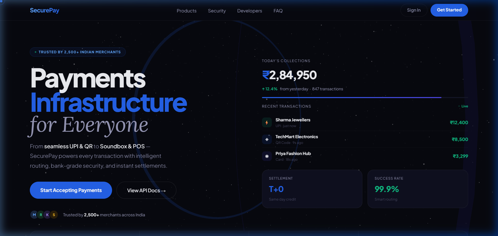
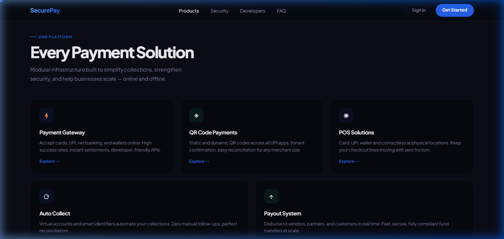
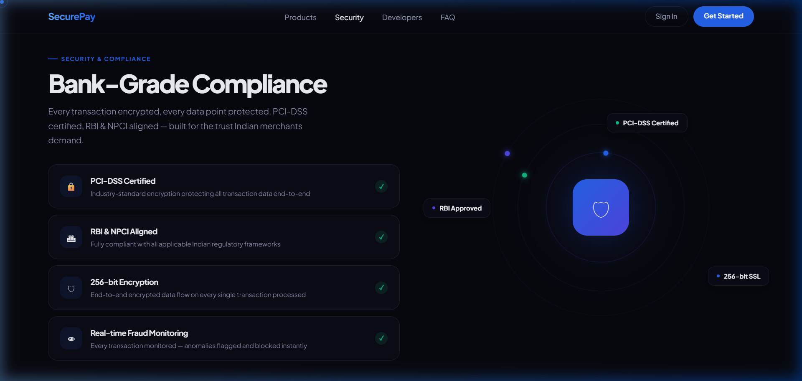
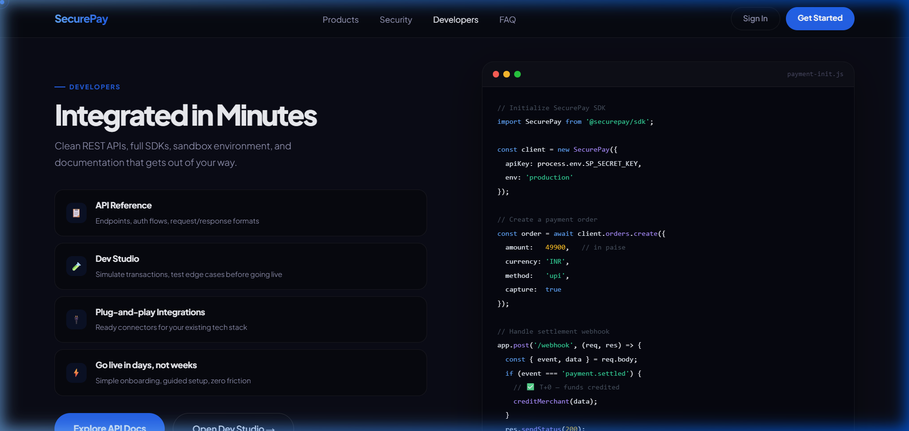
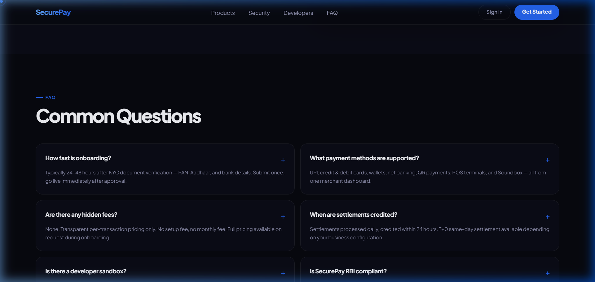
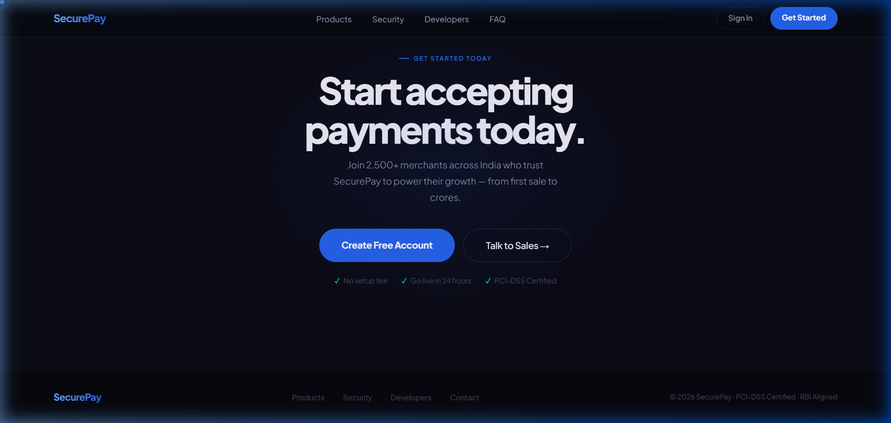

<div align="center">


### 🛡️ Next-Generation Payment Infrastructure for India

*From neighbourhood Kiranas to national enterprises — every rupee, settled with certainty.*

<br/>

[](https://trunal2005.github.io/SecurePay-Homepage)
[](https://developer.mozilla.org/en-US/docs/Web/HTML)
[](https://gsap.com/)
[](https://threejs.org/)
[](LICENSE)

</div>

---

## 📸 Live Preview

> All screenshots below are captured directly from the running application — real renders, real 3D canvas, real animations.

### 🏠 Hero — Live Payment Network



> **Three.js powered particle field** with animated 3D ring topology, live transaction feed, real-time dashboard cards, and a pulsing stats bar showing ₹1,200 Cr+ in processed payments.

---

### 📦 Products — Every Payment Solution



> A fully modular product suite covering **Payment Gateway, QR Code Payments, POS Solutions, Auto Collect**, and **Payout System** — all from a single unified platform.

---

### 🔐 Security — Bank-Grade Compliance



> Military-grade protection built in from the ground up. **PCI-DSS Level 1 Certified**, **RBI & NPCI Aligned**, **256-bit AES Encryption**, and **Real-time AI Fraud Detection** on every single transaction.

---

### ⚡ Developers — Integrated in Minutes



> Drop-in SDK, live code preview, sandbox testing, and RESTful APIs. Go from zero to live transactions in hours, not weeks. Full TypeScript support included.

---

### ❓ FAQ — Common Questions



> Clear answers on onboarding speed (24–48 hrs), supported payment methods, settlement timelines, and regulatory compliance with RBI and NPCI.

---

### 🚀 CTA — Start Today



> Zero setup fee. PCI-DSS certified. Go live in 24 hours. Join 2,500+ merchants across India.

---

## ✨ Key Features

| Feature | Description |
|---|---|
| 🌐 **Three.js 3D Background** | Interactive particle field + animated 3D ring topology that responds to mouse movement |
| ⚡ **GSAP Scroll Animations** | Professional-grade ScrollTrigger reveals on every section with sequenced entrance timing |
| 💳 **Live Transaction Feed** | Real-time cycling transaction card updating every 2.8 seconds with merchant data |
| 📊 **Animated Counter Stats** | Numbers count up on load: merchants, crores processed, success rate |
| 🖱️ **Custom CSS Cursor** | Dual-ring magnetic cursor with smooth bezier lag and blend mode effects |
| 🎨 **Glassmorphism UI** | Dark-first design with frosted glass cards, glowing borders, and depth layering |
| 📱 **Fully Responsive** | Mobile-optimised at all breakpoints — collapses gracefully below 1024px |
| 🃏 **3D Card Tilt** | GSAP-powered perspective tilt effects on dashboard cards following mouse position |
| 🔤 **Marquee Strip** | Infinite scrolling product ticker between sections for product awareness |
| 🌈 **Premium Typography** | Plus Jakarta Sans (headings) + Lora italic (accent) — sourced from Google Fonts |

---

## 🛠️ Technology Stack

```
Frontend:     HTML5 + Vanilla CSS (Zero frameworks, Pure craft)
Animations:   GSAP 3.12 (GreenSock) + ScrollTrigger Plugin
3D Rendering: Three.js r128 — particle system, torus geometry, mouse-reactive camera
Typography:   Plus Jakarta Sans · Lora (Google Fonts)
Design:       Glassmorphism · Dark Mode · Neumorphic accents · Custom cursor
```

---

## 🗂️ Project Structure

```
securepay/
│
├── index.html          ← Main homepage (all-in-one, zero dependencies)
├── assets/
│   ├── hero.png        ← Hero with 3D canvas screenshot
│   ├── products.png    ← Products suite screenshot
│   ├── security.png    ← Security section screenshot
│   ├── developers.png  ← Developer tools screenshot
│   ├── faq.png         ← FAQ layout screenshot
│   └── cta.png         ← CTA + Footer screenshot
└── README.md
```

---

## 📊 Metrics Showcased

| Metric | Value |
|---|---|
| 💰 Monthly Volume | ₹1,200 Cr+ Processed |
| 🏪 Active Merchants | 2,500+ across India |
| ✅ Payment Success | 99.9% success rate |
| ⏱️ Settlement Speed | T+0 same-day credit |
| 🕐 Support | 24×7 dedicated support |
| 🔒 Security Standard | PCI-DSS Level 1 Certified |

---

## 🚀 Running Locally

```bash
# No build step, no npm install — it's pure HTML!
# Just serve the directory:

python -m http.server 3000
# OR
npx serve .

# Now open: http://localhost:3000
```

---

## 🏗️ Architecture Notes

- **Zero build pipeline** — The entire homepage ships as a single self-contained `index.html` with all styles inline and scripts at the bottom, ensuring maximum portability and zero dependency on Node.js, bundlers, or build tools.
- **Three.js canvas** is constrained within the hero section via `position:absolute; inset:0` to prevent it from overlapping subsequent sections, which was a core rendering challenge resolved in the final version.
- **GSAP ScrollTrigger** powers all `.reveal` class animations with `top 88%` trigger thresholds tuned for visibility on first scroll.
- **Performance**: All animations use `transform` and `opacity` for GPU compositing. No `top/left` animations. Pixel ratio capped at 2 for retina screens.

---

<div align="center">

**Built with passion for the Indian digital payments ecosystem 🇮🇳**

*SecurePay · PCI-DSS Certified · RBI Aligned · © 2026*

</div>
