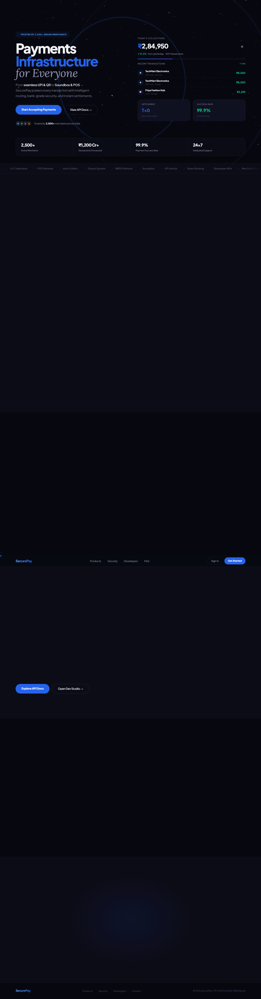

# SecurePay — Live Payment Infrastructure

SecurePay is a next-generation, high-performance payment infrastructure designed for the Indian digital economy. We provide end-to-end integration across online gateways, in-store POS systems, dynamic QR systems, and automated collections, so you can connect to the banking network at unprecedented speed.

## Fully Featured Dashboard
The dashboard features stunning **glassmorphic** aesthetics, a live transaction feed, and **Three.js** powered 3D elements dynamically rendering our payment network routing in real time.

## Core Products

- **Payment Gateway:** Lightning-fast checkouts with AI-powered smart routing across 100+ native payment methods.
- **QR Collections & Soundbox:** Reliable static & dynamic QR generation with instant audio confirmation in 10+ regional languages.
- **Auto Collect & Payouts:** Intelligent ledgering for automated reconciliation and T+0 same-day settlements for rapid liquidity.

## Institutional Grade Security 

- **PCI-DSS Level 1** Certification ensuring the highest global standard for payment protection.
- **RBI & NPCI Compliant** frameworks aligned perfectly with all domestic regulations.
- **AES-256 Encryption** applied across all endpoints globally.
- **AI Fraud Detection** delivering real-time threat scoring to proactively block suspicious activity.

## Developer First
SecurePay provides developers with immediate access to testing sandboxes, RESTful APIs, pre-built comprehensive SDKs for all major languages, and instant Webhooks with automatic retry logic. Go live securely, in days — not weeks.

## Technology Stack
- **Frontend Layouts:** HTML5
- **Styling:** Custom Vanilla CSS (Dark Themes, Dynamic gradients, Neumorphism/Glassmorphism)
- **Interactions:** Vanilla Javascript, GSAP 3.12 (GreenSock) for high-end scroll reveals, Custom Pointer
- **3D Rendering:** Three.js for interactive particle backgrounds and custom 3D topology
- **Typography:** Plus Jakarta Sans & Lora (Google Fonts)

---
*Built to serve every business, from neighborhood Kiranas to billion-dollar enterprises.*
